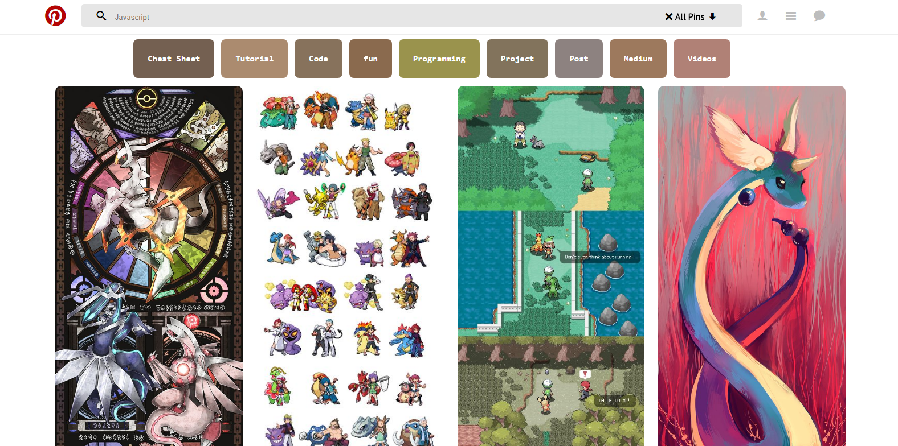
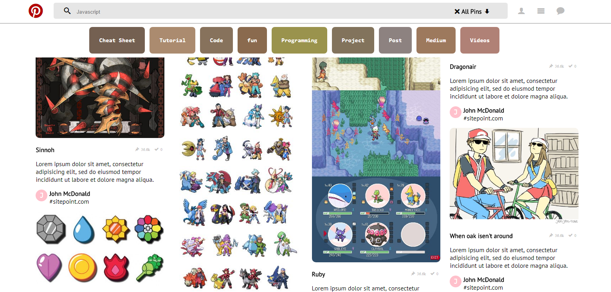
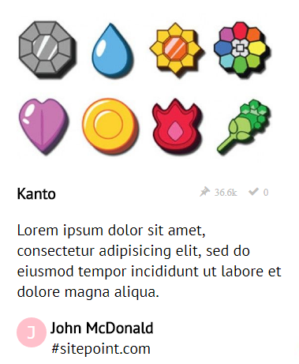

## README
1. Nombre del proyecto:
- Pinterest-Réplica
2. Autor:
- Lilliam Haro (8BM)
3. Descripción del Proyecto:
	- Este proyecto contiene la maquetación de la página Pinterest
4. Herramientas utilizadas:
	- HTML5
	- CSS3
5. Resultados Finales:
- 
- 
- 
